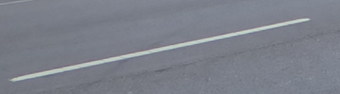
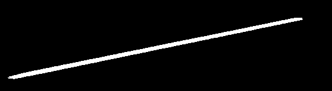

**Refine (image, object type, interior point) to a bitmask of the object**

    cat image | refine-annotation-region $OBJECT_TYPE $X $Y > mask.png

## Building

    brew install opencv     # or equivalent
    make

## Object types

### road-marking-dash

So far, this is a trivial, rigid, temporary implementation:

- apply Canny edge detection with a threshold of `45`
- for each edge pixel, if there's an edge pixel above or to the left within `max(w, h) / 3` pixels, fill the line between them

Obviously this isn't for production use &mdash;
it's a placeholder in our processing pipline that works perfectly for some annotations.

### [License: MIT](LICENSE.txt)
